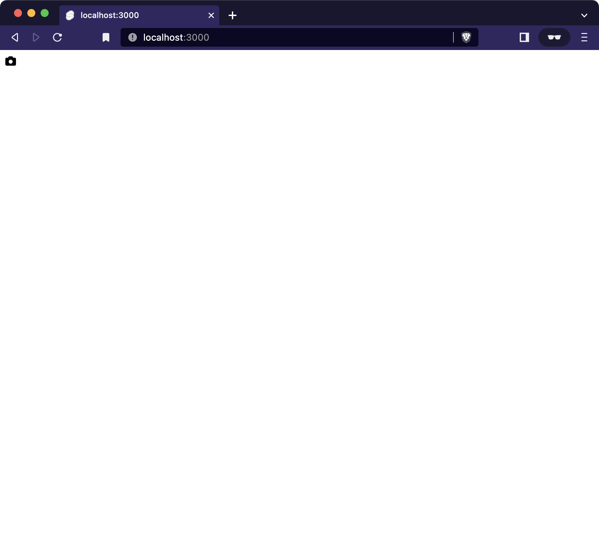
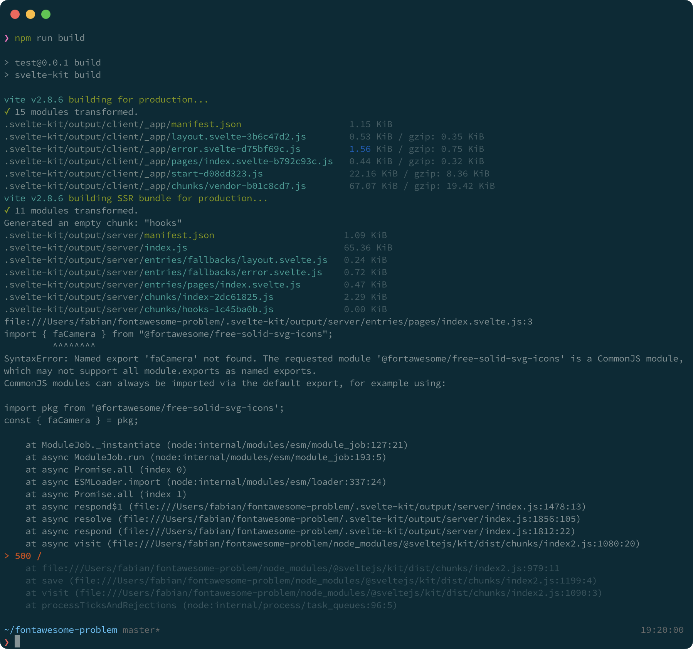

# Problem with FontAwesome

To isolate the issue I'm having, I have created this very minimal installation of SvelteKit and FontAwesome.

I did this:

```sh
npm init svelte@next
npm add --save-dev @fontawesome/fontawesome-svg-core  @fortawesome/free-solid-svg-icons
npm install
```

Then following the [instructions on FontAwesome.com](https://fontawesome.com/docs/apis/javascript/get-started)

```svelte
//index.svelte
<script>
import { library, icon } from '@fortawesome/fontawesome-svg-core'
import { faCamera } from '@fortawesome/free-solid-svg-icons'

library.add(faCamera)

const camera = icon({ prefix: 'fas', iconName: 'camera' })
</script>

{@html camera.html}
```

It works perfectly when running in dev-mode (`npm run dev`).



but if I try to build (`npm run build`), I get the following error: 



```sh
import { faCamera } from "@fortawesome/free-solid-svg-icons";
         ^^^^^^^^
SyntaxError: Named export 'faCamera' not found. The requested module '@fortawesome/free-solid-svg-icons' is a CommonJS module, which may not support all module.exports as named exports.
CommonJS modules can always be imported via the default export, for example using:

import pkg from '@fortawesome/free-solid-svg-icons';
const { faCamera } = pkg;

    at ModuleJob._instantiate (node:internal/modules/esm/module_job:127:21)
    at async ModuleJob.run (node:internal/modules/esm/module_job:193:5)
    at async Promise.all (index 0)
    at async ESMLoader.import (node:internal/modules/esm/loader:337:24)
    at async Promise.all (index 1)
    at async respond$1 (file:///Users/fabianmossberg/fontawesome-problem/.svelte-kit/output/server/index.js:1478:13)
    at async resolve (file:///Users/fabianmossberg/fontawesome-problem/.svelte-kit/output/server/index.js:1856:105)
    at async respond (file:///Users/fabianmossberg/fontawesome-problem/.svelte-kit/output/server/index.js:1812:22)
    at async visit (file:///Users/fabianmossberg/fontawesome-problem/node_modules/@sveltejs/kit/dist/chunks/index2.js:1080:20)
> 500 /
    at file:///Users/fabianmossberg/fontawesome-problem/node_modules/@sveltejs/kit/dist/chunks/index2.js:979:11
    at save (file:///Users/fabianmossberg/fontawesome-problem/node_modules/@sveltejs/kit/dist/chunks/index2.js:1199:4)
    at visit (file:///Users/fabianmossberg/fontawesome-problem/node_modules/@sveltejs/kit/dist/chunks/index2.js:1090:3)
    at processTicksAndRejections (node:internal/process/task_queues:96:5)
```


## A different approach

I get a similar problem when trying to use `icon`.

```svelte
//index.svelte
<script>
import { icon } from '@fortawesome/fontawesome-svg-core'
import { faHome } from '@fortawesome/free-solid-svg-icons/faHome'
</script>

{@html icon(faHome).html}
```

```sh
import { icon } from "@fortawesome/fontawesome-svg-core";
         ^^^^
SyntaxError: Named export 'icon' not found. The requested module '@fortawesome/fontawesome-svg-core' is a CommonJS module, which may not support all module.exports as named exports.
CommonJS modules can always be imported via the default export, for example using:

import pkg from '@fortawesome/fontawesome-svg-core';
const { icon } = pkg;
```